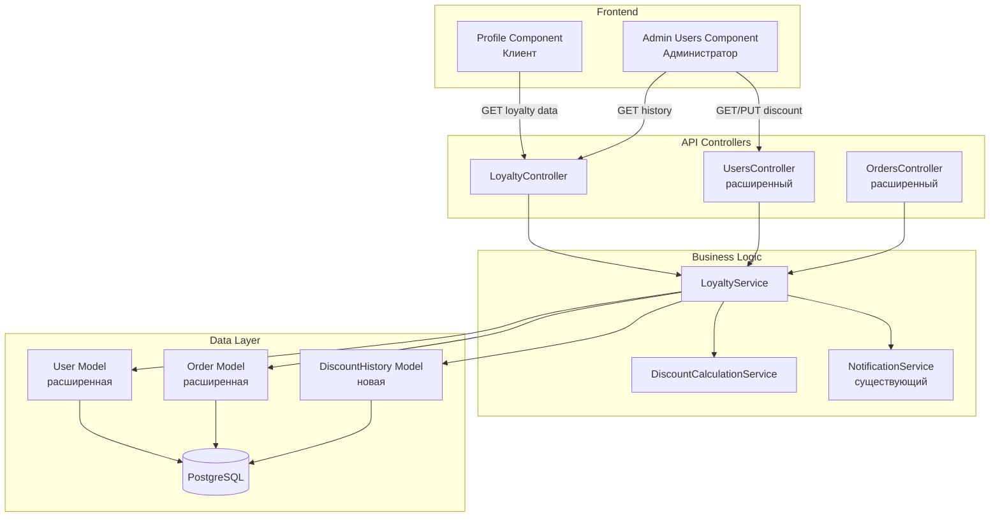

# Дизайн программы лояльности клиентов

## Обзор

Программа лояльности предоставляет систему накопительных скидок для постоянных клиентов магазина инструментов. Система автоматически отслеживает общую сумму заказов каждого клиента и позволяет администраторам назначать процентные скидки при достижении определенных порогов (1000, 5000, 10000 BYN). Скидки применяются автоматически ко всем последующим заказам клиента.

### Ключевые возможности

- Автоматическое накопление суммы заказов клиента
- Рекомендации по назначению скидок на основе порогов
- Ручное управление скидками администраторами
- Автоматическое применение скидок при оформлении заказа
- История изменений скидок с аудитом
- Уведомления клиентов об изменении скидок
- Отображение прогресса до следующего уровня скидки

## Архитектура

### Общая структура

Система интегрируется в существующую архитектуру ASP.NET Core приложения с PostgreSQL базой данных. Функциональность распределена по следующим слоям:

1. **Data Layer**: Расширение модели User и Order для хранения данных лояльности
2. **Business Logic Layer**: Сервисы для расчета скидок, обновления накопленных сумм и управления историей
3. **API Layer**: REST endpoints для управления скидками и получения данных лояльности
4. **Presentation Layer**: UI компоненты для клиентов и администраторов

### Диаграмма компонентов



### Интеграционные точки

- **OrdersController**: Обновление TotalOrdersAmount при завершении/отмене заказа
- **CartController**: Применение скидки при расчете цен в корзине
- **NotificationService**: Отправка уведомлений об изменении скидок
- **UsersController**: Управление скидками пользователей

## Компоненты и интерфейсы

### Backend компоненты

#### 1. LoyaltyService

Основной сервис для управления программой лояльности.

**Интерфейс:**

```csharp
public interface ILoyaltyService
{
    // Получение данных лояльности пользователя
    Task<LoyaltyDataDto> GetUserLoyaltyDataAsync(int userId);
    
    // Обновление скидки пользователя
    Task<bool> UpdateUserDiscountAsync(int userId, decimal newDiscount, int adminId);
    
    // Обновление накопленной суммы заказов
    Task UpdateTotalOrdersAmountAsync(int userId, decimal amount, bool isAddition);
    
    // Получение рекомендуемой скидки
    decimal GetRecommendedDiscount(decimal totalOrdersAmount);
    
    // Получение истории изменений скидок
    Task<List<DiscountHistoryDto>> GetDiscountHistoryAsync(int userId, int limit = 10);
}
```

#### 2. DiscountCalculationService

Сервис для расчета скидок и применения их к ценам.

**Интерфейс:**

```csharp
public interface IDiscountCalculationService
{
    // Применение скидки к цене
    decimal ApplyDiscount(decimal price, decimal discountPercent);
    
    // Расчет суммы скидки
    decimal CalculateDiscountAmount(decimal totalAmount, decimal discountPercent);
    
    // Расчет прогресса до следующего порога
    DiscountProgressDto CalculateProgress(decimal totalOrdersAmount, decimal currentDiscount);
}
```

#### 3. LoyaltyController

REST API контроллер для работы с программой лояльности.

**Endpoints:**

```
GET    /api/loyalty/user/{userId}           - Получить данные лояльности пользователя
GET    /api/loyalty/user/{userId}/history   - Получить историю изменений скидок
PUT    /api/loyalty/user/{userId}/discount  - Обновить скидку пользователя (Admin)
GET    /api/loyalty/thresholds              - Получить пороги скидок
```

### Frontend компоненты

#### 1. Profile Loyalty Section (Клиент)

Секция в профиле клиента для отображения данных лояльности.

**Отображаемые данные:**
- Текущий процент скидки
- Общая сумма заказов
- Прогресс до следующего уровня (прогресс-бар)
- Информация о следующем пороге

#### 2. Admin Loyalty Management (Администратор)

Расширение страницы управления пользователями для работы со скидками.

**Функциональность:**
- Отображение TotalOrdersAmount и CurrentDiscount в списке пользователей
- Фильтрация по диапазону TotalOrdersAmount
- Фильтрация по диапазону CurrentDiscount
- Сортировка по TotalOrdersAmount и CurrentDiscount
- Модальное окно для изменения скидки с рекомендациями
- Просмотр истории изменений скидок

## Модели данных

### Расширение модели User

```csharp
public partial class User
{
    // Существующие поля...
    
    // Новые поля для программы лояльности
    public decimal TotalOrdersAmount { get; set; } = 0;
    public decimal CurrentDiscount { get; set; } = 0;
}
```

### Расширение модели Order

```csharp
public partial class Order
{
    // Существующие поля...
    
    // Новые поля для программы лояльности
    public decimal? AppliedDiscount { get; set; }      // Процент примененной скидки
    public decimal? DiscountAmount { get; set; }       // Сумма скидки в BYN
}
```

### Новая модель DiscountHistory

```csharp
public class DiscountHistory
{
    public int Id { get; set; }
    public int UserId { get; set; }
    public decimal OldDiscount { get; set; }
    public decimal NewDiscount { get; set; }
    public int ChangedBy { get; set; }                 // ID администратора
    public DateTime ChangedAt { get; set; }
    public string? Reason { get; set; }                // Опциональная причина изменения
    
    public virtual User User { get; set; } = null!;
    public virtual User ChangedByUser { get; set; } = null!;
}
```

### DTOs

```csharp
public class LoyaltyDataDto
{
    public int UserId { get; set; }
    public decimal TotalOrdersAmount { get; set; }
    public decimal CurrentDiscount { get; set; }
    public decimal RecommendedDiscount { get; set; }
    public DiscountProgressDto Progress { get; set; }
}

public class DiscountProgressDto
{
    public decimal CurrentAmount { get; set; }
    public decimal NextThreshold { get; set; }
    public decimal NextThresholdDiscount { get; set; }
    public int ProgressPercent { get; set; }
    public bool IsMaxLevel { get; set; }
}

public class DiscountHistoryDto
{
    public int Id { get; set; }
    public decimal OldDiscount { get; set; }
    public decimal NewDiscount { get; set; }
    public string ChangedByName { get; set; }
    public DateTime ChangedAt { get; set; }
    public string? Reason { get; set; }
}

public class UpdateDiscountDto
{
    public decimal NewDiscount { get; set; }
    public string? Reason { get; set; }
}
```

### Схема базы данных

**Изменения в таблице Users:**

```sql
ALTER TABLE Users 
ADD COLUMN TotalOrdersAmount DECIMAL(10,2) DEFAULT 0 NOT NULL,
ADD COLUMN CurrentDiscount DECIMAL(5,2) DEFAULT 0 NOT NULL,
ADD CONSTRAINT chk_total_orders_amount CHECK (TotalOrdersAmount >= 0),
ADD CONSTRAINT chk_current_discount CHECK (CurrentDiscount >= 0 AND CurrentDiscount <= 100);

CREATE INDEX idx_users_total_orders_amount ON Users(TotalOrdersAmount);
CREATE INDEX idx_users_current_discount ON Users(CurrentDiscount);
```

**Изменения в таблице Orders:**

```sql
ALTER TABLE Orders
ADD COLUMN AppliedDiscount DECIMAL(5,2),
ADD COLUMN DiscountAmount DECIMAL(10,2),
ADD CONSTRAINT chk_applied_discount CHECK (AppliedDiscount IS NULL OR (AppliedDiscount >= 0 AND AppliedDiscount <= 100)),
ADD CONSTRAINT chk_discount_amount CHECK (DiscountAmount IS NULL OR DiscountAmount >= 0);
```

**Новая таблица DiscountHistory:**

```sql
CREATE TABLE DiscountHistory (
    Id SERIAL PRIMARY KEY,
    UserId INT NOT NULL,
    OldDiscount DECIMAL(5,2) NOT NULL,
    NewDiscount DECIMAL(5,2) NOT NULL,
    ChangedBy INT NOT NULL,
    ChangedAt TIMESTAMP DEFAULT NOW() NOT NULL,
    Reason TEXT,
    
    CONSTRAINT fk_discount_history_user FOREIGN KEY (UserId) REFERENCES Users(Id) ON DELETE CASCADE,
    CONSTRAINT fk_discount_history_changed_by FOREIGN KEY (ChangedBy) REFERENCES Users(Id) ON DELETE RESTRICT,
    CONSTRAINT chk_old_discount CHECK (OldDiscount >= 0 AND OldDiscount <= 100),
    CONSTRAINT chk_new_discount CHECK (NewDiscount >= 0 AND NewDiscount <= 100)
);

CREATE INDEX idx_discount_history_user_id ON DiscountHistory(UserId);
CREATE INDEX idx_discount_history_changed_at ON DiscountHistory(ChangedAt DESC);
```


## Correctness Properties

*A property is a characteristic or behavior that should hold true across all valid executions of a system-essentially, a formal statement about what the system should do. Properties serve as the bridge between human-readable specifications and machine-verifiable correctness guarantees.*

После анализа требований и выявления избыточности, определены следующие ключевые свойства для тестирования:

### Property 1: Инициализация нового пользователя

*For any* newly created user, the TotalOrdersAmount field should be initialized to 0.

**Validates: Requirements 2.1**

### Property 2: Накопление суммы при завершении заказа

*For any* order that transitions to "Completed" status, the user's TotalOrdersAmount should increase by the order's TotalAmount.

**Validates: Requirements 2.2**

### Property 3: Уменьшение суммы при отмене заказа

*For any* order that is cancelled, the user's TotalOrdersAmount should decrease by the order's TotalAmount, but should never become negative (minimum value is 0).

**Validates: Requirements 2.3, 8.1**

### Property 4: Персистентность TotalOrdersAmount

*For any* change to TotalOrdersAmount, reading the value from the database immediately after the change should return the updated value (round-trip property).

**Validates: Requirements 2.4, 2.5**

### Property 5: Валидация процента скидки

*For any* discount value input, the system should accept values in the range [0, 100] and reject all values outside this range with an appropriate error message.

**Validates: Requirements 3.3, 8.2, 8.3**

### Property 6: Персистентность скидки

*For any* discount update, reading the CurrentDiscount from the database immediately after the update should return the new value (round-trip property).

**Validates: Requirements 3.4**

### Property 7: Уведомление при изменении скидки

*For any* discount change (increase or decrease), the system should create a notification for the user containing the old discount, new discount, and change date.

**Validates: Requirements 3.5, 7.1, 7.2, 7.3, 7.4**

### Property 8: Рекомендации скидок по порогам

*For any* user with TotalOrdersAmount, the system should recommend:
- 0% discount if TotalOrdersAmount < 1000 BYN
- 3% discount if 1000 BYN ≤ TotalOrdersAmount < 5000 BYN
- 5% discount if 5000 BYN ≤ TotalOrdersAmount < 10000 BYN
- 10% discount if TotalOrdersAmount ≥ 10000 BYN

**Validates: Requirements 4.1, 4.2, 4.3, 4.4**

### Property 9: Применение скидки к цене товара

*For any* product price and any discount percentage, the discounted price should equal: price × (1 - discount/100), and the result should be non-negative.

**Validates: Requirements 5.1**

### Property 10: Применение скидки к заказу

*For any* order created by a user with CurrentDiscount > 0, the order should have AppliedDiscount equal to the user's CurrentDiscount at the time of order creation, and DiscountAmount should equal TotalAmount × (AppliedDiscount/100).

**Validates: Requirements 5.2, 5.3, 5.4**

### Property 11: Логирование изменений скидки

*For any* discount change, the system should create a DiscountHistory record containing UserId, OldDiscount, NewDiscount, ChangedBy (admin ID), and ChangedAt (timestamp).

**Validates: Requirements 6.1, 6.2, 6.3**

### Property 12: Получение истории изменений

*For any* user, querying the discount history should return all DiscountHistory records for that user, ordered by ChangedAt descending.

**Validates: Requirements 6.5**

### Property 13: Сохранение скидки при отмене заказа

*For any* order cancellation, the user's TotalOrdersAmount should be updated (decreased), but the CurrentDiscount should remain unchanged.

**Validates: Requirements 8.4**

### Property 14: API возвращает данные лояльности

*For any* valid user ID, calling GET /api/loyalty/user/{userId} should return a response containing TotalOrdersAmount and CurrentDiscount fields.

**Validates: Requirements 9.1**

### Property 15: API обновляет скидку с валидацией

*For any* PUT request to /api/loyalty/user/{userId}/discount with a valid discount value [0-100], the user's CurrentDiscount should be updated to the new value (round-trip property).

**Validates: Requirements 9.2**

### Property 16: API возвращает историю изменений

*For any* valid user ID, calling GET /api/loyalty/user/{userId}/history should return an array of DiscountHistory records for that user.

**Validates: Requirements 9.3**

### Property 17: API обновляет TotalOrdersAmount при завершении заказа

*For any* order, calling POST /api/orders/{id}/complete should update the associated user's TotalOrdersAmount by adding the order's TotalAmount.

**Validates: Requirements 9.4**

### Property 18: API возвращает корректные ошибки

*For any* API error response, the response should contain a meaningful error message and an appropriate HTTP status code (4xx for client errors, 5xx for server errors).

**Validates: Requirements 9.5**

### Property 19: Фильтрация пользователей

*For any* filter criteria (TotalOrdersAmount range or CurrentDiscount range), the filtered user list should contain only users whose values fall within the specified ranges.

**Validates: Requirements 10.3**

### Property 20: Сортировка пользователей

*For any* sort field (TotalOrdersAmount or CurrentDiscount) and sort direction (ascending or descending), the returned user list should be ordered correctly according to the specified field and direction.

**Validates: Requirements 10.4, 10.5**

## Обработка ошибок

### Валидация входных данных

1. **Процент скидки**: Должен быть в диапазоне [0, 100]
   - Ошибка: "Процент скидки должен быть от 0 до 100"
   - HTTP Status: 400 Bad Request

2. **User ID**: Должен существовать в базе данных
   - Ошибка: "Пользователь не найден"
   - HTTP Status: 404 Not Found

3. **Admin ID**: Должен иметь роль Admin
   - Ошибка: "Недостаточно прав для выполнения операции"
   - HTTP Status: 403 Forbidden

### Обработка граничных случаев

1. **TotalOrdersAmount < 0**: Автоматически устанавливается в 0
2. **Одновременное изменение скидки**: Используется оптимистичная блокировка (версионирование)
3. **Отмена уже завершенного заказа**: Возвращается ошибка "Невозможно отменить завершенный заказ"

### Транзакционность

Все операции, изменяющие TotalOrdersAmount и CurrentDiscount, должны выполняться в транзакциях:

```csharp
using var transaction = await _context.Database.BeginTransactionAsync();
try
{
    // Обновление данных
    await _context.SaveChangesAsync();
    await transaction.CommitAsync();
}
catch (Exception ex)
{
    await transaction.RollbackAsync();
    throw;
}
```

### Логирование

Все изменения скидок логируются в таблицу DiscountHistory для аудита:
- Кто изменил (ChangedBy)
- Когда изменил (ChangedAt)
- Старое и новое значение (OldDiscount, NewDiscount)
- Причина изменения (Reason)

## Стратегия тестирования

### Dual Testing Approach

Для обеспечения надежности системы используется комбинированный подход:

1. **Unit Tests**: Проверка конкретных примеров, граничных случаев и обработки ошибок
2. **Property-Based Tests**: Проверка универсальных свойств на большом количестве сгенерированных входных данных

### Unit Testing

**Фокус на:**
- Конкретные примеры расчета скидок (например, 1000 BYN → 3%, 5000 BYN → 5%)
- Граничные случаи (TotalOrdersAmount = 0, CurrentDiscount = 100)
- Обработка ошибок (невалидные значения скидок, несуществующие пользователи)
- Интеграция с существующими компонентами (OrdersController, NotificationService)

**Примеры unit тестов:**

```csharp
[Fact]
public async Task UpdateDiscount_WithValidValue_ShouldUpdateDatabase()
{
    // Arrange
    var user = new User { Id = 1, CurrentDiscount = 0 };
    // Act
    await _loyaltyService.UpdateUserDiscountAsync(1, 5, adminId: 1);
    // Assert
    Assert.Equal(5, user.CurrentDiscount);
}

[Fact]
public void GetRecommendedDiscount_With1000BYN_ShouldReturn3Percent()
{
    // Act
    var discount = _loyaltyService.GetRecommendedDiscount(1000);
    // Assert
    Assert.Equal(3, discount);
}

[Fact]
public async Task UpdateDiscount_WithInvalidValue_ShouldThrowException()
{
    // Act & Assert
    await Assert.ThrowsAsync<ValidationException>(
        () => _loyaltyService.UpdateUserDiscountAsync(1, 150, adminId: 1)
    );
}
```

### Property-Based Testing

**Библиотека**: FsCheck для C# (порт QuickCheck для .NET)

**Конфигурация**: Минимум 100 итераций на тест

**Фокус на:**
- Универсальные свойства, которые должны выполняться для всех входных данных
- Инварианты системы (TotalOrdersAmount ≥ 0, 0 ≤ CurrentDiscount ≤ 100)
- Round-trip свойства (сохранение и чтение данных)
- Математические свойства расчетов

**Примеры property-based тестов:**

```csharp
[Property]
public Property NewUser_ShouldHaveZeroTotalOrdersAmount()
{
    return Prop.ForAll<string, string>(
        (email, name) =>
        {
            var user = new User { Email = email, FullName = name };
            return user.TotalOrdersAmount == 0;
        }
    ).Label("Feature: customer-loyalty-program, Property 1: For any newly created user, TotalOrdersAmount should be 0");
}

[Property]
public Property DiscountValidation_ShouldAcceptValidRange()
{
    return Prop.ForAll(
        Arb.Default.Decimal().Generator.Where(d => d >= 0 && d <= 100),
        validDiscount =>
        {
            var result = _discountCalculationService.ValidateDiscount(validDiscount);
            return result.IsValid;
        }
    ).Label("Feature: customer-loyalty-program, Property 5: Discount validation should accept [0-100]");
}

[Property]
public Property ApplyDiscount_ShouldNeverReturnNegative()
{
    return Prop.ForAll<decimal, decimal>(
        (price, discount) =>
        {
            if (price < 0 || discount < 0 || discount > 100) return true;
            var result = _discountCalculationService.ApplyDiscount(price, discount);
            return result >= 0;
        }
    ).Label("Feature: customer-loyalty-program, Property 9: Discounted price should never be negative");
}

[Property]
public Property TotalOrdersAmount_RoundTrip()
{
    return Prop.ForAll<int, decimal>(
        (userId, amount) =>
        {
            if (amount < 0) return true;
            _loyaltyService.UpdateTotalOrdersAmountAsync(userId, amount, true).Wait();
            var result = _loyaltyService.GetUserLoyaltyDataAsync(userId).Result;
            return result.TotalOrdersAmount == amount;
        }
    ).Label("Feature: customer-loyalty-program, Property 4: TotalOrdersAmount round-trip");
}
```

### Integration Testing

**Фокус на:**
- Взаимодействие между компонентами (Controller → Service → Database)
- Транзакционность операций
- Конкурентные изменения данных
- End-to-end сценарии (создание заказа → завершение → обновление TotalOrdersAmount → назначение скидки)

### Тестирование производительности

**Критерии:**
- Обновление TotalOrdersAmount: < 100ms
- Загрузка данных лояльности: < 500ms
- API запросы: < 200ms

**Инструменты**: BenchmarkDotNet для микробенчмарков

### Тестовые данные

**Генерация тестовых данных:**
- Пользователи с различными TotalOrdersAmount (0, 500, 1000, 5000, 10000, 50000 BYN)
- Пользователи с различными CurrentDiscount (0%, 3%, 5%, 10%, 15%)
- Заказы с различными суммами
- История изменений скидок

