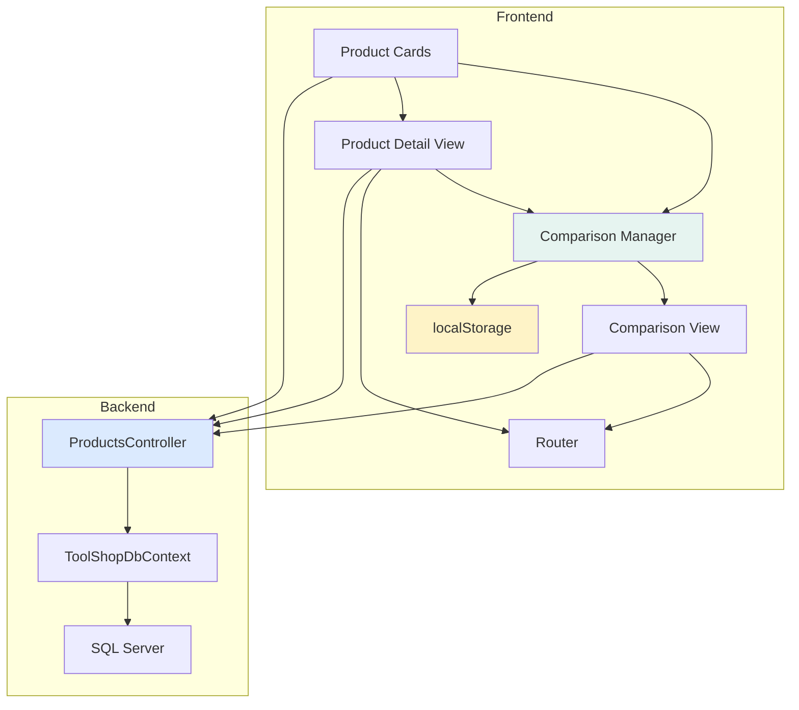

# Design Document: Product Comparison and Detailed Product Pages

## Overview

This design implements product comparison functionality and detailed product pages for the B2B tool shop application. The solution consists of:

1. **Backend Enhancement**: New API endpoint for fetching product details with related products
2. **Frontend Components**: Product detail view, comparison view, and comparison management UI
3. **Client-Side Storage**: localStorage-based persistence for comparison list
4. **Responsive Design**: Mobile-optimized layouts for both detail and comparison views

The design follows the existing application architecture:
- ASP.NET Core Web API backend with Entity Framework Core
- Vanilla JavaScript SPA frontend with client-side routing
- Existing design system (colors, typography, components)
- SQL Server database with existing Product, ProductAttribute, and Category models

## Architecture

### System Components



### Data Flow

1. **Product Detail Page Load**:
   - User clicks product → Router navigates to `/product/{id}`
   - Frontend calls `GET /api/products/{id}/details`
   - Backend fetches product with attributes and related products
   - Frontend renders detail view with all data

2. **Comparison List Management**:
   - User clicks "Add to Comparison" → ComparisonManager adds product
   - ComparisonManager persists to localStorage
   - UI updates to show comparison count
   - User navigates to comparison view → Frontend fetches full product data for all items

3. **Comparison View**:
   - Frontend loads product IDs from localStorage
   - Batch fetch all products via existing `/api/products/{id}` endpoint
   - Render side-by-side comparison with aligned attributes

## Components and Interfaces

### Backend Components

#### ProductsController Enhancement

Add new endpoint for product details with related products:

```csharp
[HttpGet("{id}/details")]
public async Task<ActionResult<ProductDetailDto>> GetProductDetails(int id)
{
    // Fetch product with attributes
    var product = await _context.Products
        .Include(p => p.ProductAttributes)
        .Include(p => p.Category)
        .FirstOrDefaultAsync(p => p.Id == id && p.IsActive == true);
    
    if (product == null)
        return NotFound();
    
    // Fetch related products from same category (exclude current product)
    var relatedProducts = await _context.Products
        .Where(p => p.CategoryId == product.CategoryId 
                 && p.Id != id 
                 && p.IsActive == true)
        .Take(4)
        .Select(p => new RelatedProductDto { ... })
        .ToListAsync();
    
    // Build category breadcrumb
    var breadcrumb = await BuildCategoryBreadcrumb(product.CategoryId);
    
    return new ProductDetailDto
    {
        Product = await MapToProductDto(product),
        RelatedProducts = relatedProducts,
        Breadcrumb = breadcrumb
    };
}

private async Task<List<BreadcrumbItem>> BuildCategoryBreadcrumb(int? categoryId)
{
    // Recursively build breadcrumb from category to root
    var breadcrumb = new List<BreadcrumbItem>();
    var currentCategoryId = categoryId;
    
    while (currentCategoryId.HasValue)
    {
        var category = await _context.Categories
            .FirstOrDefaultAsync(c => c.Id == currentCategoryId);
        
        if (category == null) break;
        
        breadcrumb.Insert(0, new BreadcrumbItem
        {
            Id = category.Id,
            Name = category.Name
        });
        
        currentCategoryId = category.ParentId;
    }
    
    return breadcrumb;
}
```

### Frontend Components

#### 1. Router Enhancement

Add route handling for product detail pages:

```javascript
// In existing router
function handleRoute() {
    const path = window.location.pathname;
    
    // Existing routes...
    
    // New: Product detail route
    if (path.startsWith('/product/')) {
        const productId = parseInt(path.split('/')[2]);
        if (!isNaN(productId)) {
            showProductDetail(productId);
            return;
        }
    }
    
    // New: Comparison route
    if (path === '/comparison') {
        showComparisonView();
        return;
    }
    
    // Default: show catalog
    showCatalog();
}

function navigateToProduct(productId) {
    window.history.pushState({}, '', `/product/${productId}`);
    handleRoute();
}

function navigateToComparison() {
    window.history.pushState({}, '', '/comparison');
    handleRoute();
}
```

#### 2. ComparisonManager Module

Manages comparison list state and localStorage persistence:

```javascript
const ComparisonManager = {
    STORAGE_KEY: 'product_comparison_list',
    MAX_PRODUCTS: 4,
    
    // Get current comparison list
    getList() {
        const stored = localStorage.getItem(this.STORAGE_KEY);
        return stored ? JSON.parse(stored) : [];
    },
    
    // Add product to comparison
    add(productId) {
        const list = this.getList();
        if (list.length >= this.MAX_PRODUCTS) {
            return { success: false, reason: 'max_reached' };
        }
        if (list.includes(productId)) {
            return { success: false, reason: 'already_added' };
        }
        list.push(productId);
        localStorage.setItem(this.STORAGE_KEY, JSON.stringify(list));
        this.notifyChange();
        return { success: true };
    },
    
    // Remove product from comparison
    remove(productId) {
        let list = this.getList();
        list = list.filter(id => id !== productId);
        localStorage.setItem(this.STORAGE_KEY, JSON.stringify(list));
        this.notifyChange();
    },
    
    // Check if product is in comparison
    has(productId) {
        return this.getList().includes(productId);
    },
    
    // Get count of products in comparison
    getCount() {
        return this.getList().length;
    },
    
    // Clear all products
    clear() {
        localStorage.removeItem(this.STORAGE_KEY);
        this.notifyChange();
    },
    
    // Notify UI of changes
    notifyChange() {
        window.dispatchEvent(new CustomEvent('comparison-changed', {
            detail: { count: this.getCount(), list: this.getList() }
        }));
    }
};
```

#### 3. Product Detail View

Renders comprehensive product information:

```javascript
async function showProductDetail(productId) {
    const contentArea = document.querySelector('.content-area');
    contentArea.innerHTML = '<div class="loading-spinner">Loading...</div>';
    
    try {
        const response = await fetch(`/api/products/${productId}/details`);
        if (!response.ok) {
            if (response.status === 404) {
                contentArea.innerHTML = renderProductNotFound();
                return;
            }
            throw new Error('Failed to load product');
        }
        
        const data = await response.json();
        contentArea.innerHTML = renderProductDetail(data);
        attachProductDetailHandlers(data.product);
    } catch (error) {
        contentArea.innerHTML = renderError(error.message);
    }
}

function renderProductDetail(data) {
    const { product, relatedProducts, breadcrumb } = data;
    const isInComparison = ComparisonManager.has(product.id);
    const isAvailable = product.stock > 0;
    
    return `
        <div class="product-detail-container">
            <!-- Breadcrumb -->
            <nav class="breadcrumb-nav">
                <a href="/" class="breadcrumb-item">Каталог</a>
                ${breadcrumb.map(item => `
                    <span class="breadcrumb-separator">›</span>
                    <a href="/?category=${item.id}" class="breadcrumb-item">${item.name}</a>
                `).join('')}
                <span class="breadcrumb-separator">›</span>
                <span class="breadcrumb-current">${product.name}</span>
            </nav>
            
            <!-- Main Product Section -->
            <div class="product-detail-main">
                <!-- Product Image -->
                <div class="product-detail-image">
                    
                </div>
                
                <!-- Product Info -->
                <div class="product-detail-info">
                    <div class="product-detail-header">
                        <div>
                            <h1 class="product-detail-title">${product.name}</h1>
                            <p class="product-detail-article">Артикул: ${product.article}</p>
                        </div>
                        <div class="product-detail-price">
                            ${product.price.toLocaleString('ru-RU')} ₽
                        </div>
                    </div>
                    
                    <!-- Availability -->
                    <div class="product-detail-availability">
                        ${isAvailable 
                            ? `<span class="availability-badge available">
                                <i class="fas fa-check-circle"></i> В наличии (${product.stock} шт.)
                               </span>`
                            : `<span class="availability-badge unavailable">
                                <i class="fas fa-times-circle"></i> Нет в наличии
                               </span>`
                        }
                    </div>
                    
                    <!-- Description -->
                    ${product.description ? `
                        <div class="product-detail-description">
                            <h3>Описание</h3>
                            <p>${product.description}</p>
                        </div>
                    ` : ''}
                    
                    <!-- Actions -->
                    <div class="product-detail-actions">
                        <button class="btn btn-primary btn-lg" 
                                data-action="add-to-cart"
                                ${!isAvailable ? 'disabled' : ''}>
                            <i class="fas fa-shopping-cart"></i>
                            ${isAvailable ? 'Добавить в корзину' : 'Нет в наличии'}
                        </button>
                        <button class="btn btn-outline" 
                                data-action="toggle-comparison">
                            <i class="fas fa-${isInComparison ? 'times' : 'balance-scale'}"></i>
                            ${isInComparison ? 'Убрать из сравнения' : 'Добавить к сравнению'}
                        </button>
                    </div>
                </div>
            </div>
            
            <!-- Specifications -->
            ${product.attributes && product.attributes.length > 0 ? `
                <div class="product-specifications">
                    <h2>Технические характеристики</h2>
                    <div class="specifications-table">
                        ${product.attributes.map(attr => `
                            <div class="specification-row">
                                <div class="specification-name">${attr.attrName}</div>
                                <div class="specification-value">${attr.attrValue}</div>
                            </div>
                        `).join('')}
                    </div>
                </div>
            ` : ''}
            
            <!-- Related Products -->
            ${relatedProducts && relatedProducts.length > 0 ? `
                <div class="related-products-section">
                    <h2>Похожие товары</h2>
                    <div class="related-products-grid">
                        ${relatedProducts.map(p => renderRelatedProductCard(p)).join('')}
                    </div>
                </div>
            ` : ''}
        </div>
    `;
}

function renderRelatedProductCard(product) {
    return `
        <div class="product-card" onclick="navigateToProduct(${product.id})">
            
            <div class="product-card-content">
                <h4 class="product-card-title">${product.name}</h4>
                <p class="product-card-article">${product.article}</p>
                <div class="product-card-price">${product.price.toLocaleString('ru-RU')} ₽</div>
            </div>
        </div>
    `;
}

function attachProductDetailHandlers(product) {
    // Add to cart handler
    document.querySelector('[data-action="add-to-cart"]')?.addEventListener('click', async () => {
        await addToCart(product.id);
        showNotification('Товар добавлен в корзину', 'success');
    });
    
    // Toggle comparison handler
    document.querySelector('[data-action="toggle-comparison"]')?.addEventListener('click', () => {
        if (ComparisonManager.has(product.id)) {
            ComparisonManager.remove(product.id);
            showNotification('Товар удален из сравнения', 'info');
        } else {
            const result = ComparisonManager.add(product.id);
            if (result.success) {
                showNotification('Товар добавлен к сравнению', 'success');
            } else if (result.reason === 'max_reached') {
                showNotification('Максимум 4 товара для сравнения', 'warning');
            }
        }
        // Re-render to update button state
        showProductDetail(product.id);
    });
}
```

#### 4. Comparison View

Displays products side-by-side with aligned attributes:

```javascript
async function showComparisonView() {
    const contentArea = document.querySelector('.content-area');
    const productIds = ComparisonManager.getList();
    
    if (productIds.length === 0) {
        contentArea.innerHTML = renderEmptyComparison();
        return;
    }
    
    contentArea.innerHTML = '<div class="loading-spinner">Loading...</div>';
    
    try {
        // Fetch all products in parallel
        const products = await Promise.all(
            productIds.map(id => fetch(`/api/products/${id}`).then(r => r.json()))
        );
        
        contentArea.innerHTML = renderComparisonView(products);
        attachComparisonHandlers();
    } catch (error) {
        contentArea.innerHTML = renderError('Failed to load comparison');
    }
}

function renderComparisonView(products) {
    // Collect all unique attribute names
    const allAttributes = new Map();
    products.forEach(product => {
        product.attributes?.forEach(attr => {
            if (!allAttributes.has(attr.attrName)) {
                allAttributes.set(attr.attrName, new Set());
            }
            allAttributes.get(attr.attrName).add(attr.attrValue);
        });
    });
    
    return `
        <div class="comparison-container">
            <div class="comparison-header">
                <h1>Сравнение товаров</h1>
                <button class="btn btn-outline" onclick="ComparisonManager.clear(); showCatalog();">
                    <i class="fas fa-times"></i> Очистить все
                </button>
            </div>
            
            <div class="comparison-table-wrapper">
                <table class="comparison-table">
                    <!-- Product Headers -->
                    <thead>
                        <tr>
                            <th class="comparison-label-column">Характеристика</th>
                            ${products.map(product => `
                                <th class="comparison-product-column">
                                    <div class="comparison-product-header">
                                        
                                        <h3>${product.name}</h3>
                                        <p class="comparison-article">${product.article}</p>
                                        <div class="comparison-price">${product.price.toLocaleString('ru-RU')} ₽</div>
                                        <div class="comparison-actions">
                                            <button class="btn btn-primary btn-sm" 
                                                    data-action="add-to-cart" 
                                                    data-product-id="${product.id}"
                                                    ${product.stock <= 0 ? 'disabled' : ''}>
                                                <i class="fas fa-shopping-cart"></i> В корзину
                                            </button>
                                            <button class="btn btn-outline btn-sm" 
                                                    data-action="remove" 
                                                    data-product-id="${product.id}">
                                                <i class="fas fa-times"></i> Удалить
                                            </button>
                                        </div>
                                    </div>
                                </th>
                            `).join('')}
                        </tr>
                    </thead>
                    
                    <!-- Basic Info -->
                    <tbody>
                        <tr>
                            <td class="comparison-label">Наличие</td>
                            ${products.map(product => `
                                <td class="${product.stock > 0 ? 'text-success' : 'text-danger'}">
                                    ${product.stock > 0 ? `В наличии (${product.stock} шт.)` : 'Нет в наличии'}
                                </td>
                            `).join('')}
                        </tr>
                        
                        <!-- Attributes -->
                        ${Array.from(allAttributes.entries()).map(([attrName, values]) => {
                            const isDifferent = values.size > 1;
                            return `
                                <tr class="${isDifferent ? 'comparison-row-different' : ''}">
                                    <td class="comparison-label">${attrName}</td>
                                    ${products.map(product => {
                                        const attr = product.attributes?.find(a => a.attrName === attrName);
                                        return `<td>${attr ? attr.attrValue : '—'}</td>`;
                                    }).join('')}
                                </tr>
                            `;
                        }).join('')}
                    </tbody>
                </table>
            </div>
        </div>
    `;
}

function renderEmptyComparison() {
    return `
        <div class="empty-state">
            <i class="fas fa-balance-scale empty-state-icon"></i>
            <h2>Список сравнения пуст</h2>
            <p>Добавьте товары для сравнения, чтобы увидеть их характеристики рядом</p>
            <button class="btn btn-primary" onclick="showCatalog()">
                Перейти в каталог
            </button>
        </div>
    `;
}

function attachComparisonHandlers() {
    // Add to cart handlers
    document.querySelectorAll('[data-action="add-to-cart"]').forEach(btn => {
        btn.addEventListener('click', async () => {
            const productId = parseInt(btn.dataset.productId);
            await addToCart(productId);
            showNotification('Товар добавлен в корзину', 'success');
        });
    });
    
    // Remove from comparison handlers
    document.querySelectorAll('[data-action="remove"]').forEach(btn => {
        btn.addEventListener('click', () => {
            const productId = parseInt(btn.dataset.productId);
            ComparisonManager.remove(productId);
            showComparisonView(); // Re-render
        });
    });
}
```

#### 5. Product Card Enhancement

Add comparison button to existing product cards:

```javascript
function renderProductCard(product) {
    const isInComparison = ComparisonManager.has(product.id);
    const isAvailable = product.stock > 0;
    
    return `
        <div class="product-card">
            ${!isAvailable ? '<div class="product-badge">Нет в наличии</div>' : ''}
            
            <div class="product-card-image" onclick="navigateToProduct(${product.id})">
                
            </div>
            
            <div class="product-card-content">
                <h3 class="product-card-title" onclick="navigateToProduct(${product.id})">
                    ${product.name}
                </h3>
                <p class="product-card-article">${product.article}</p>
                <div class="product-card-footer">
                    <div class="product-card-price">${product.price.toLocaleString('ru-RU')} ₽</div>
                    <div class="product-card-actions">
                        <button class="btn btn-primary btn-sm" 
                                onclick="addToCart(${product.id})"
                                ${!isAvailable ? 'disabled' : ''}>
                            <i class="fas fa-shopping-cart"></i>
                        </button>
                        <button class="btn btn-outline btn-sm ${isInComparison ? 'active' : ''}" 
                                onclick="toggleComparison(${product.id})"
                                title="${isInComparison ? 'Убрать из сравнения' : 'Добавить к сравнению'}">
                            <i class="fas fa-balance-scale"></i>
                        </button>
                    </div>
                </div>
            </div>
        </div>
    `;
}

function toggleComparison(productId) {
    if (ComparisonManager.has(productId)) {
        ComparisonManager.remove(productId);
        showNotification('Товар удален из сравнения', 'info');
    } else {
        const result = ComparisonManager.add(productId);
        if (result.success) {
            showNotification('Товар добавлен к сравнению', 'success');
        } else if (result.reason === 'max_reached') {
            showNotification('Максимум 4 товара для сравнения', 'warning');
        }
    }
    // Re-render current view to update button states
    handleRoute();
}
```

#### 6. Comparison Indicator in Header

Add comparison count indicator to header:

```javascript
function renderComparisonIndicator() {
    const count = ComparisonManager.getCount();
    
    if (count === 0) {
        return '';
    }
    
    return `
        <button class="header-icon-btn" onclick="navigateToComparison()" title="Сравнение товаров">
            <i class="fas fa-balance-scale"></i>
            <span class="icon-badge">${count}</span>
        </button>
    `;
}

// Listen for comparison changes and update indicator
window.addEventListener('comparison-changed', () => {
    const indicator = document.querySelector('.comparison-indicator');
    if (indicator) {
        indicator.outerHTML = renderComparisonIndicator();
    }
});
```

## Data Models

### DTOs (Data Transfer Objects)

#### ProductDetailDto

```csharp
public class ProductDetailDto
{
    public ProductDto Product { get; set; }
    public List<RelatedProductDto> RelatedProducts { get; set; }
    public List<BreadcrumbItem> Breadcrumb { get; set; }
}
```

#### RelatedProductDto

```csharp
public class RelatedProductDto
{
    public int Id { get; set; }
    public string Article { get; set; }
    public string Name { get; set; }
    public decimal Price { get; set; }
    public string? ImageUrl { get; set; }
    public int Stock { get; set; }
}
```

#### BreadcrumbItem

```csharp
public class BreadcrumbItem
{
    public int Id { get; set; }
    public string Name { get; set; }
}
```

### Client-Side Data Structures

#### Comparison List (localStorage)

```javascript
// Stored as JSON array of product IDs
// Key: 'product_comparison_list'
// Value: [1, 5, 12, 23]
```

## Correctness Properties

